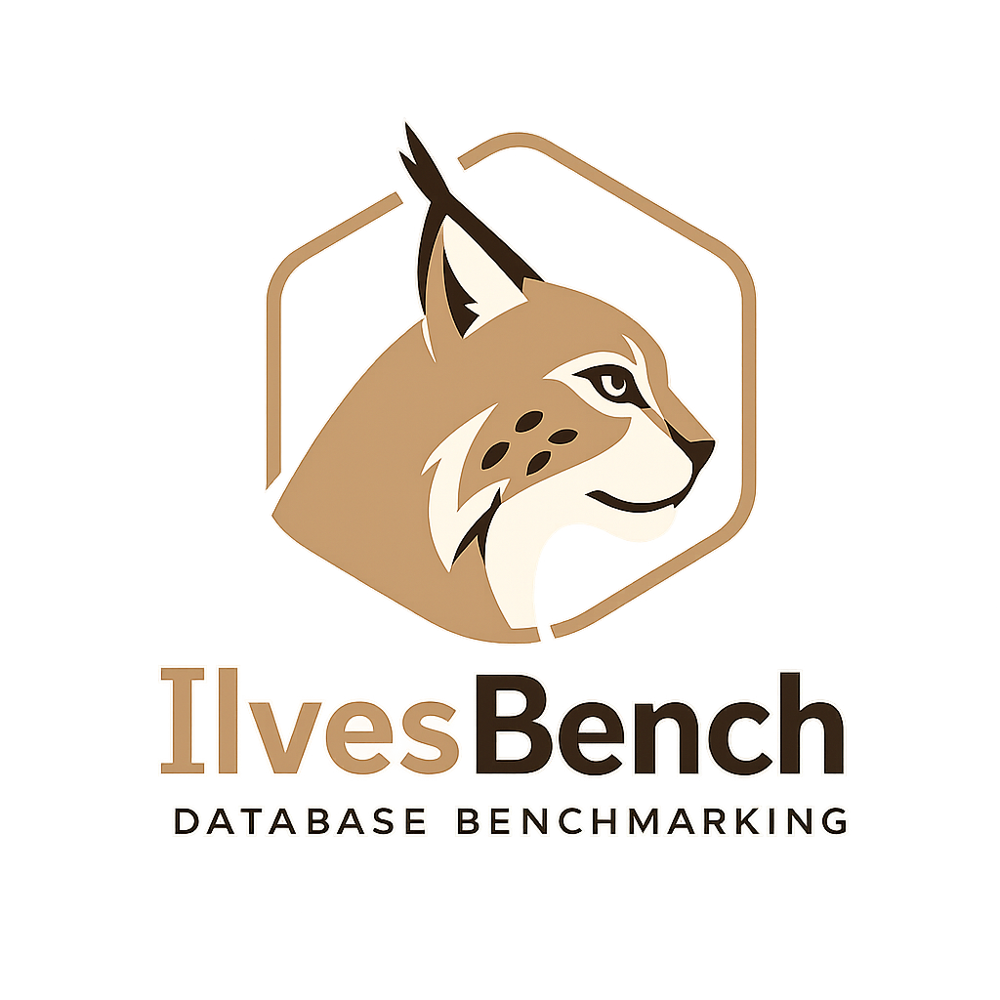

# IlvesBench

<p align="center">
  
</p>

IlvesBench is a PostgreSQL benchmarking and schema-evolution prototype. It compares a selected source database with a target database, helps generate and review normalization SQL, data migration SQL, query rewrites, summary table recommendations, index recommendations, and `pgbench` workloads.

The prototype is intentionally human-in-the-loop: generated SQL is visible, editable, and approval-gated before PostgreSQL-side changes are executed.

## Current Shape

- Database-pair workspaces are the main unit of state: selected source DB, target DB, schemas, saved SQL artifacts, workloads, and recommendations.
- Runs are still kept as execution and diagnostics history.
- Live database facts in the GUI come from PostgreSQL metadata where possible, not from old run state.
- LLM calls are planner/interpreter actions only. The LLM does not access PostgreSQL or the OS directly.

## Architecture

- `agent/`: orchestration and workflow coordination
- `dbops/` and `db/`: PostgreSQL inspection, validation, schema creation, data migration, and database-side actions
- `osops/`: hardware inspection, workload/log input, file access, and subprocess support
- `benchmarker/` and `benchmark/`: query rewriting, workload generation, pgbench, tuning, summary table and index advisors
- `llm/` and `orchestrator/`: LLM gateway and LLM-backed planning tasks
- `store/`: run history, diagnostics, and database-pair workspace artifacts
- `api/` and `static/`: HTTP API and browser GUI

## Setup

```bash
python3 -m venv .venv
source .venv/bin/activate
pip install -e .
pip install "psycopg[binary]>=3.2,<4"
```

Start the bundled PostgreSQL stack if needed:

```bash
docker compose up -d
```

Launch the web UI:

```bash
python3 run_ilvesbench.py serve --config ilvesbench.example.toml
```

The sample config uses:

```text
http://127.0.0.1:8081
```

## Configuration

Use `ilvesbench.example.toml` as the template. Keep local overrides in ignored files such as `ilvesbench.toml`, `*.local.toml`, `.env`, or `secrets/`.

LLM API keys are resolved in this order:

- `ILVESBENCH_LLM_API_KEY`
- `[llm].api_key_file`
- `[llm].api_key`

For local secret-file use:

```bash
mkdir -p secrets
printf 'sk-your-key-here' > secrets/aviary_api_key
```

## NETIO energy measurement

NETIO 4KF / PowerBOX measurement is optional. Add credentials only to a local configuration file, then run the benchmark normally:

```toml
[netio]
url = "http://192.168.1.78/netio.json"
username = "netio"
password = "netio"
poll_interval_seconds = 1.0
timeout_seconds = 5.0
```

IlvesBench polls the NETIO JSON API throughout each `pgbench` run and stores average, minimum, and maximum watts; per-socket average watts; and the NETIO energy-counter delta. The Benchmark page shows average power alongside TPS and latency. If `url` is empty, it reports: “No energy measurement hardware was found.”

## Workloads

IlvesBench can use a workload SQL file from the GUI or the configured `[workload].path`. PostgreSQL log extraction exists as an OSOps pathway, but workload-file based input is the main development path right now.

A workload is a set of SQL statements plus proportions. The prototype preserves constants in workload files unless the user explicitly supplies pgbench-style placeholders.

## pgbench

`pgbench` settings are editable in the GUI. IlvesBench can also recommend starting values from detected hardware.

```toml
[pgbench]
enabled = true
command = "pgbench"
duration_seconds = 30
clients = 4
jobs = 1
```

`pgbench` must be installed on the host running IlvesBench. IlvesBench requests periodic `pgbench` progress reports (one second by default) and stores interval TPS and latency samples. After a benchmark finishes, the Benchmark page renders TPS-over-time charts and, when NETIO is configured, sampled power-over-time charts from the persisted run artifacts.

## Diagnostics

Each execution run writes human-readable and JSONL diagnostics under `data/artifacts/<run_id>/logs/`. LLM prompts, raw responses, PostgreSQL errors, and pgbench errors are saved as artifacts and shown in the GUI Diagnostics tab.

## Tests

```bash
PYTHONPATH=src python3 -m unittest discover -s tests
```

## Disclaimer

This software is provided "as is", without warranty of any kind, express or implied. By using, modifying, or distributing this software, you acknowledge and agree that you do so entirely at your own risk. The authors, contributors, and maintainers shall not be liable for any claim, damages, loss, or other liability arising from or related to the use of this software.
